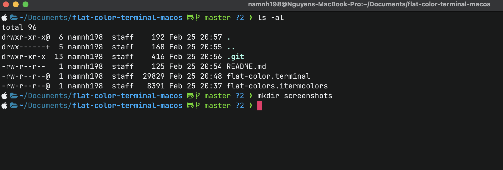
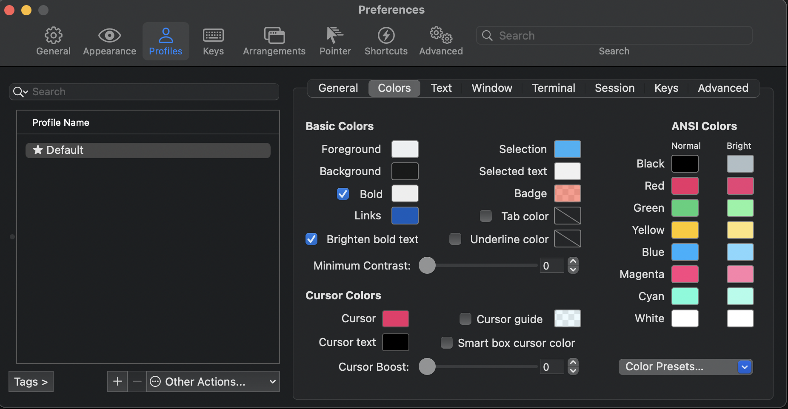
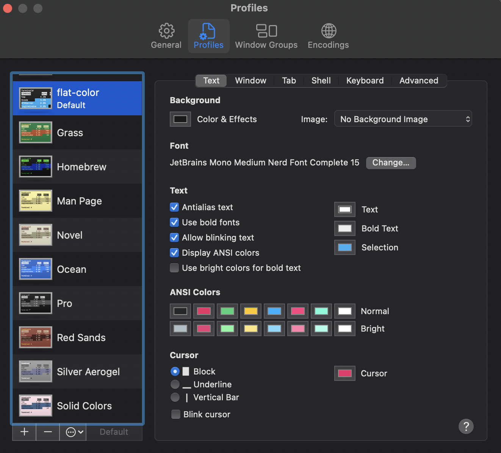

# Dark flat iterm2 color scheme



# Dark flat terminal color scheme


## Usage

```
git clone https://github.com/namnh198/flat-color-terminal-macos.git
```

Simply import the flat-colors.itermcolors & flat-colors.terminal file into your iterm & terminal profile color settings.

It's as easy as that.

**Setting Iterm 2**



**Setting Terminal**



## Extra information

Screenshots included here are taken with oh-my-zsh and Powerlevel10k installed.
